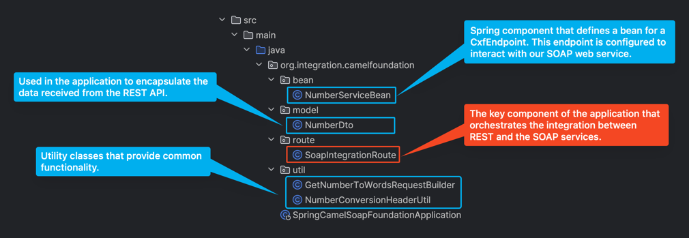
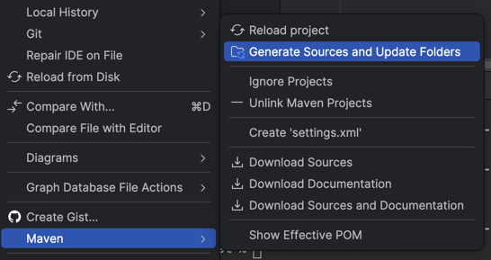

# Getting Started

### Reference Documentation

This implementation demonstrates the use of camel with spring boot to create a simple REST API that accepts a
JSON request and integrates with a SOAP Web Service.

The SOAP Web Service is a Number Conversion service that converts a number to words.
The WDSL for the SOAP Web Service is located at this address:
<code>http://www.dataaccess.com/webservicesserver/numberconversion.wso?WSDL</code>
### Code Structure
The project structure is quite simple.<br>



### Setup
As the application integrates with a SOAP Web Service, we need to generate the java classes from the WSDL.<br>
To do this, we use the org.apache.cxf maven plugin.<br>
The plugin is configured in the pom.xml file as follows:
```xml
<plugin>
    <groupId>org.apache.cxf</groupId>
    <artifactId>cxf-codegen-plugin</artifactId>
    <version>4.0.2</version>
    <executions>
        <execution>
            <id>generate-sources</id>
            <phase>generate-sources</phase>
            <configuration>
                <wsdlOptions>
                    <wsdlOption>
                        <wsdl>https://www.dataaccess.com/webservicesserver/numberconversion.wso?WSDL</wsdl>
                    </wsdlOption>
                </wsdlOptions>
            </configuration>
            <goals>
                <goal>wsdl2java</goal>
            </goals>
        </execution>
    </executions>
</plugin>
```

The WDSL doesn't necessarily have to be online. It can be downloaded and stored locally and then referenced in the
pom.xml file.
```xml
    ...
    <wsdlOption>
        <wsdl>src/main/resources/wsdl/numberconversion.wsdl</wsdl>
    </wsdlOption>
    ...
```
To generate the java classes, run the following command:
```shell
mvn clean install
```

> In my case after the java artifacts are generated, they are not automatically added to the project.<br>
To add them, right-click on the project folder, select maven, then generate sources and update 
> folders (for IntelliJ users).<br>
>
>
>

### Deep Dive in the Code
For those more into the technical details, here is a brief view of what's under the hood.

#### REST Controller (Camel REST DSL)
We expose two REST endpoints using the Camel REST DSL.<br>

On <code>SoapIntegrationRoute.java</code>:
* extend the <code>RouteBuilder</code> class and override the <code>configure()</code> method.
    ```java
    @Component
    public class SoapIntegrationRoute extends RouteBuilder { ... }
    ```
* apply the rest configuration in the <code>configure()</code> method.
    ```java
    restConfiguration()
        .component("netty-http")
        .host("localhost")
        .port("8081")
        .bindingMode(RestBindingMode.auto);
    ```
    Netty is used as the HTTP server as i found it easier to configure and use.<br>
    Another option is to use the servlet component <code>restConfiguration().component("servlet")</code>.
* define the two REST endpoints.
    ```java
    rest("/api")
        .post("/convert-number-to-words")
            .type(NumberDto.class)
            .to("direct:number-to-words")
            .produces(MediaType.APPLICATION_JSON_VALUE)
        .post("/convert-number-to-dollars")
            .type(NumberDto.class)
            .to("direct:number-to-dollars")
            .produces(MediaType.APPLICATION_JSON_VALUE);
    ```
    That will expose
    ```html
    http://localhost:8081/api/convert-number-to-words
    http://localhost:8081/api/convert-number-to-dollars
    ```
    Call the endpoints by passing on the json type of <code>NumberDto</code>:
    ```json
    {
      "number": "123"
    }
    ```
    The <code>.to("direct:number-to-words")</code> and <code>.to("direct:number-to-dollars")</code> are the routes 
    that will be called when the REST endpoint is called (essentially forwarding the request to the routes).
* define the routes that will be called from the REST endpoints.
    ```java
    from("direct:number-to-words")
    ...
    
  from("direct:number-to-dollars")
    ...
    ```
#### Camel Routes (Camel Java DSL)
This is the logic to parse the REST request, prepare the call to the SOAP Web Service, and parse the SOAP response.

* retrieve and parse the REST request payload
    ```java
    from("direct:number-to-words")
        .process(exchange -> {
            NumberDto numberDto = exchange.getIn().getBody(NumberDto.class);
            BigInteger number = new BigInteger(numberDto.getNumber());
            exchange.getIn().setBody(number);
        })
    ```
    The <code>number</code> is set on the exchange body to be used later in the route.
* prepare the payload for the SOAP request
    ```java
    .bean(GetNumberToWordsRequestBuilder.class, "getNumberToWords")
    ```
    Camel processors can be defined as beans and used in the route.<br>
    In this case, the <code>GetNumberToWordsRequestBuilder</code> class is a spring component that builds the SOAP
    request payload.<br>
    As the <code>GetNumberToWordsRequestBuilder</code> class has two methods, we need to specify which method to invoke: 
    <code>getNumberToWords</code>.<br>
    
    ```java
    public NumberToWords getNumberToWords(BigInteger number) {
        NumberToWords request = new NumberToWords();
        request.setUbiNum(number);
        return request;
    }
    ```
    We're not explicitly passing the <code>number</code> to the <code>getNumberToWords</code> method call,
    but just setting it on the exchange body. And that is enough for camel to pass it as a parameter to the method.<br>
    And since the data type from the body matches the data type of the method parameter ... happy days, the method is
    invoked correctly.
* call the SOAP Web Service
    ```java
    ...
    .marshal().jaxb()  
    .process(NumberConversionHeaderUtil::setNumberToWordsHeader)    
    .to("cxf:bean:numberConversionEndpoint")
    ...
    ```
    While setting the headers we also need to indicate the endpoint name and the namespace.
    ```java
    ...
    private static String OPERATION_NAMESPACE = "http://www.dataaccess.com/webservicesserver/";
    private static String SERVICE_NAME = "NumberConversion";
    
    public static void setCommonHeaders(Exchange exchange, String operationName) {
        QName serviceName = new QName(OPERATION_NAMESPACE, SERVICE_NAME);
        ...
    }
  
    public static void setNumberToWordsHeader(Exchange exchange) {
        setCommonHeaders(exchange, "NumberToWords");
    }
    ```
    To call the SOAP Web Service, we need to transform the payload to XML, set the SOAP header, and then call the
    endpoint.<br>
    We're using the <code>cxf</code> component to call the SOAP Web Service.
    The <code>NumberServiceBean</code> holds the configuration for the SOAP WS call.
    ```java
    @Component
    public class NumberServiceBean {
        @Bean
        public CxfEndpoint numberConversionEndpoint() {
            CxfEndpoint cxfEndpoint = new CxfEndpoint();
            cxfEndpoint.setDataFormat(DataFormat.PAYLOAD);
            cxfEndpoint.setAddress("https://www.dataaccess.com/webservicesserver/numberconversion.wso");
            cxfEndpoint.setWsdlURL("https://www.dataaccess.com/webservicesserver/numberconversion.wso?WSDL");
            cxfEndpoint.setPortNameAsQName(new QName("http://www.dataaccess.com/webservicesserver/", "NumberConversionSoap"));
        return cxfEndpoint;
        }
    }
    ```
    All the details for the SOAP Web Service call are set in the <code>NumberServiceBean</code> class.

#### Handle SOAP Response and carry on...
The SOAP response is handled using a processor.
```java
...
.process(exchange -> {
    NumberToWordsResponse response = exchange.getIn().getBody(NumberToWordsResponse.class);
    })
...
```
We're not doing much with the response right here (just getting hold of it), but you can do whatever you want with it.
You can create a REST response dto object, or set it to the exchange body to be used in the next route.

```java 
...
.unmarshal().jaxb("com.dataaccess.webservicesserver")
.marshal(jsonDataFormat)
.end();
...
```
The last step is to transform the SOAP response to JSON and return it to the REST endpoint.
* unmarshal the SOAP response to a java object providing the <code>com.dataaccess.webservicesserver</code> which is 
the context path for the package that contains the generated classes from the WSDL.
* marshal the java object to JSON.
* end the route.

### Run the Application
To run the application, make sure you have the latest maven installed and java 21 or above.
Run:
```shell
mvn clean install
mvn spring-boot:run
```

### Next Steps
This application just gives you the basic idea of how to integrate camel with spring boot.<br>
There are a lot of things that can be done to improve it:
* add unit tests
* add integration tests
* add proper logging
* add exception handling
* add security
* **make it more modular**

To make the solution more modular, we could create separate modules for each SOAP web service integration.<br>
In the end we could have a main component that integrates with multiple module libraries (built as jars), 
each handling communication with a specific SOAP web service.<br> 
With this approach, the integrations are encapsulated in their own modules, 
making the overall architecture more extensible and maintainable.

### References
* I couldn't find a good example of how to integrate camel with spring boot, so I had to go through the camel docs and
  examples to figure out how to do it.
* [Using Apache Camel with Spring Boot](https://camel.apache.org/camel-spring-boot/latest/spring-boot.html)
